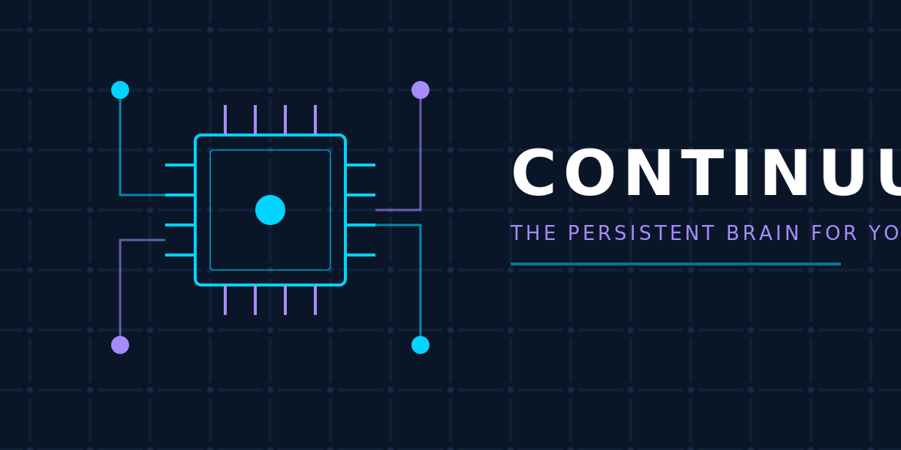
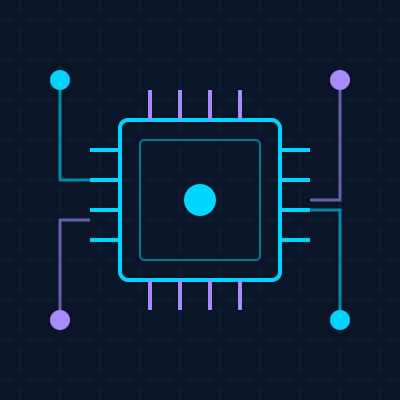

<div align="center">

<!-- ============== CIRCUIT BOARD LOGO ============== -->


<br/><br/>

<!-- ============== BADGES ============== -->
<p>
  <a href="LICENSE"></a>
  
  
  
  
  
</p>

<p>
  
  
  
  
</p>

<h3>
  <em>Spin it up. Every agent on your network now shares a brain.</em>
</h3>

```bash
docker compose up -d
```

</div>

<br/>

---

## THE PROBLEM

You run a swarm of AI agents. Hermes handles the frontend. Claude Code ships features. Codex writes PRs. OpenClaw drives the backend.

Every single session starts from **absolute zero**.

You re-explain your project. You re-teach preferences. You burn through tokens and patience like a man trying to fill a leaky bucket.

> **Session amnesia is the silent killer of agent productivity.**

<br/>

## THE FIX

<div align="center">

| WITHOUT CONTINUUM | WITH CONTINUUM |
|---|---|
| "What stack are we using again?" | "I see Hermes already documented the stack." |
| "Did we decide on OAuth or JWT?" | "Claude's episodic memory shows the OAuth decision." |
| "Why did we choose PostgreSQL?" | "Semantic memory: PostgreSQL + pgvector for vector search." |
| 500 tokens of context lost | Zero tokens wasted on re-explaining |

</div>

<br/>

## QUICK START

```bash
# 1. Clone
git clone https://github.com/anarudhan/continuum.git
cd continuum

# 2. Spin it up
docker compose up -d

# 3. Grab your API key from logs
docker compose logs api | grep "API Key"

# 4. Start writing memory
curl -X POST http://localhost:8080/api/v1/memories \
  -H "X-API-Key: ctm_..." \
  -H "Content-Type: application/json" \
  -d '{
    "type": "semantic",
    "content": "Project uses Go 1.24 with Gin framework",
    "visibility": "shared"
  }'
```

<br/>

## ARCHITECTURE

```
┌─────────────────────────────────────────────────────────────┐
│                      CONTINUUM MESH                          │
├─────────────────────────────────────────────────────────────┤
│                                                              │
│   ┌──────────┐    ┌──────────┐    ┌──────────┐            │
│   │  Hermes  │◄──►│  Claude  │◄──►│  Codex   │            │
│   │  (You)   │    │  Code    │    │          │            │
│   └────┬─────┘    └────┬─────┘    └────┬─────┘            │
│        │               │               │                   │
│        └───────────────┼───────────────┘                   │
│                        │                                    │
│              ┌─────────▼──────────┐                        │
│              │   Continuum API    │                        │
│              │   (Go + Gin)       │                        │
│              └─────────┬──────────┘                        │
│                        │                                    │
│         ┌──────────────┼──────────────┐                    │
│         │              │              │                    │
│    ┌────▼────┐   ┌────▼────┐   ┌────▼────┐               │
│    │PostgreSQL│   │  Redis  │   │WebSocket│               │
│    │+ pgvector│   │  Cache  │   │  Sync   │               │
│    └─────────┘   └─────────┘   └─────────┘               │
│                                                              │
└─────────────────────────────────────────────────────────────┘
```

<br/>

## MEMORY TYPES EXPLAINED

| TYPE | STORES | EXAMPLE |
|------|--------|---------|
| **EPISODIC** | Session transcripts, decisions | "Decided OAuth2 + PKCE for auth" |
| **SEMANTIC** | Facts, entities, relationships | "Project: Anarudhan, Stack: Go + React" |
| **PROCEDURAL** | Skills, workflows, patterns | "Deploy: 1) test 2) build 3) push" |

<br/>

## HOW A WRITE CYCLE WORKS

```
Agent writes memory
        │
        ▼
┌───────────────┐
│  API receives │ ──► Validate + sanitize
│    request    │
└───────┬───────┘
        │
        ▼
┌───────────────┐
│  PostgreSQL   │ ──► Store with vector embedding
│   + pgvector  │
└───────┬───────┘
        │
        ▼
┌───────────────┐
│    Redis      │ ──► Cache + pub/sub broadcast
│   Pub/Sub     │
└───────┬───────┘
        │
        ▼
┌───────────────┐
│  WebSocket    │ ──► Push to all connected agents
│   Broadcast   │
└───────────────┘
```

<br/>

## TECH STACK

| Layer | Technology | Why |
|-------|-----------|-----|
| **API** | Go 1.24 + Gin v1.10 | Fast, simple, battle-tested |
| **Database** | PostgreSQL 16 + pgvector | ACID + vector search |
| **Cache** | Redis 7 | Pub/sub + rate limiting |
| **Frontend** | React 19 + Vite 6 + Tailwind 4 | Modern, fast DX |
| **State** | Zustand 5 + TanStack Query 5 | Minimal, powerful |
| **Protocol** | MCP (Model Context Protocol) | Agent-native integration |

<br/>

## FEATURE COMPARISON

| Feature | Continuum | Mem0 | Dory | IM.codes |
|---------|-----------|------|------|----------|
| Self-hosted | ✅ | ❌ | ✅ | ❌ |
| Cross-agent | ✅ | ❌ | ❌ | ❌ |
| Real-time sync | ✅ | ❌ | ❌ | ❌ |
| Cost tracking | ✅ | ❌ | ❌ | ❌ |
| MCP protocol | ✅ | ❌ | ❌ | ❌ |
| Token budget guard | ✅ | ❌ | ❌ | ❌ |
| Open source | ✅ | ❌ | ✅ | ❌ |

<br/>

## ROADMAP

| Phase | Status | Description |
|-------|--------|-------------|
| **Phase 1** | ✅ Complete | Database schema + models + stores |
| **Phase 2** | ✅ Complete | API server + middleware + handlers |
| **Phase 3** | ✅ Complete | Memory service + WebSocket + MCP |
| **Phase 4** | ✅ Complete | React dashboard + Docker compose |
| **Phase 5** | 🔄 In Progress | Agent integrations (Hermes, Claude, Codex) |
| **Phase 6** | 📋 Planned | Vector search + knowledge graph |
| **Phase 7** | 📋 Planned | Multi-tenant + enterprise features |

<br/>

## DOCUMENTATION

- [API Reference](docs/api-reference.md)
- [Agent Integration Guide](docs/agent-integration.md)
- [Memory Types Deep Dive](docs/memory-types.md)
- [Self-Hosting Guide](docs/self-hosting.md)
- [Security Model](docs/security.md)
- [Brand System](branding/BRAND_SYSTEM.md)

<br/>

## CONTRIBUTORS

Built with 💙 by [Sathis Anarudhan](https://github.com/anarudhan) and the agent swarm.

<br/>

## LICENSE

MIT License — see [LICENSE](LICENSE) for details.

---

<div align="center">



<p><strong>CONTINUUM</strong> — The Persistent Brain for Your Agent Swarm</p>

</div>
