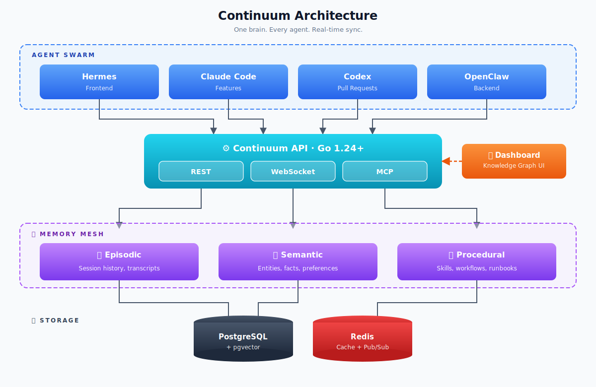
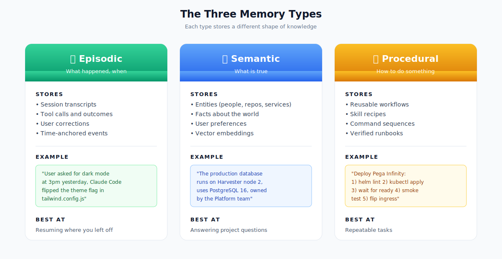
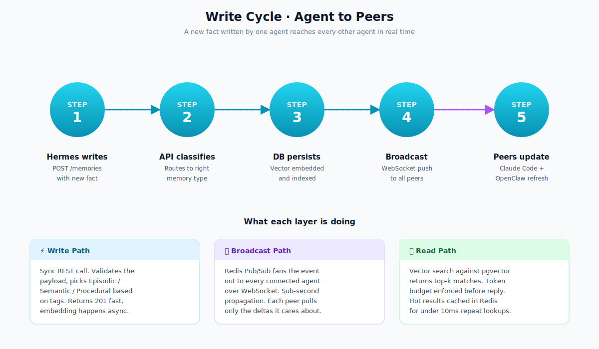
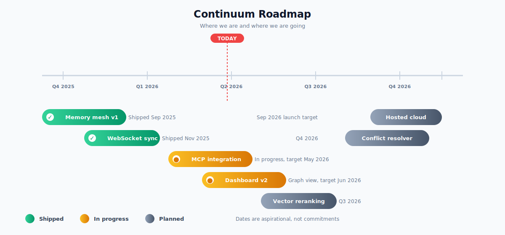

<div align="center">

<!-- ============== ANIMATED HEADER BANNER ============== -->


<!-- ============== TYPING ANIMATION ============== -->
<a href="https://github.com/anarudhan/continuum">
  
</a>

<br/><br/>

<!-- ============== BADGES ============== -->
<p>
  <a href="LICENSE"></a>
  
  
  
  
  
</p>

<p>
  
  
  
  
</p>

<h3>
  <em>Spin it up. Every agent on your network now shares a brain.</em>
</h3>

```bash
docker compose up -d
```

</div>

<br/>

<!-- ============== TABLE OF CONTENTS ============== -->
<details open>
<summary><strong>📚 Table of Contents</strong></summary>

- [The Problem](#-the-problem)
- [The Fix](#-the-fix)
- [Quick Start](#-quick-start)
- [Architecture](#-architecture)
- [Memory Types Explained](#-memory-types-explained)
- [How a Write Cycle Works](#-how-a-write-cycle-works)
- [Tech Stack](#-tech-stack)
- [Feature Comparison](#-feature-comparison)
- [Roadmap](#-roadmap)
- [Documentation](#-documentation)
- [Contributors](#-contributors)
- [License](#-license)

</details>

<br/>

---

## 🧨 The Problem

You run a swarm of AI agents. Hermes handles the frontend. Claude Code ships features. Codex writes PRs. OpenClaw drives the backend.

Every single session starts from **absolute zero**.

You re-explain your project. You re-teach preferences. You burn through tokens and patience like a man trying to fill a leaky bucket.

> **Session amnesia is the silent killer of agent productivity.**

<br/>

## ✨ The Fix

<div align="center">

### Continuum gives your entire agent swarm a shared, persistent brain.

</div>

A single source of truth that all your agents read from and write to in real time. Episodic memory remembers what happened. Semantic memory remembers what is true. Procedural memory remembers how to do things. A knowledge graph ties it all together with a beautiful UI on top.

<br/>

<div align="center">

| 🧠 Three Memory Types | ⚡ Real-Time Sync | 🔓 Agent-Agnostic | 💰 Cost Guardrails |
| :---: | :---: | :---: | :---: |
| Episodic, Semantic, Procedural | WebSocket push to every connected agent | Works with Claude Code, Codex, Hermes, anything | Built-in token budgets and quotas |

</div>

<br/>

---

## 🚀 Quick Start

```bash
# 1. Clone the repo
git clone https://github.com/anarudhan/continuum.git
cd continuum

# 2. Fire it up
docker compose up -d

# 3. That is it, brother
```

<br/>

Once it is running you get three endpoints.

| Endpoint | URL | What it does |
| --- | --- | --- |
| 🎨 **Dashboard** | http://localhost:8080 | Knowledge graph UI, browse memories, audit logs |
| 🔌 **REST API** | http://localhost:8080/api/v1 | CRUD for memories, search, retrieval |
| 📡 **WebSocket** | ws://localhost:8080/ws | Real-time sync across all connected agents |

<br/>

---

## 🏗️ Architecture

<div align="center">



</div>

Agents talk to the API over three protocols. The API classifies incoming writes into the right memory type and persists them. Reads hit pgvector for semantic search and Redis for the hot path. The Dashboard sits alongside the API serving the knowledge graph UI.

<br/>

---

## 🧠 Memory Types Explained

Three flavours, each with a job to do.

<div align="center">



</div>

### How the three types differ

| Type | Stores | Best at |
| --- | --- | --- |
| 📼 **Episodic** | What happened, when, by whom | Resuming where you left off |
| 🧩 **Semantic** | What is true about the world | Answering project questions |
| 🛠️ **Procedural** | How to do something | Repeatable tasks |

<br/>

---

## 🔄 How a Write Cycle Works

From "agent writes a fact" to "every peer agent has it" takes under a second.

<div align="center">



</div>

<br/>

---

## 🛠️ Tech Stack

<div align="center">

<a href="https://skillicons.dev">
  
</a>

</div>

<br/>

| Layer | Tech | Why |
| --- | --- | --- |
| **Backend** | Go 1.24+ | Single static binary, brilliant concurrency, low memory footprint |
| **Frontend** | TypeScript 5.7+ · React · Vite | Type safety end to end, fast HMR |
| **Vector DB** | PostgreSQL + pgvector | One database for relational and vector, no extra moving parts |
| **Cache** | Redis | Hot path lookups, pub-sub backbone for WebSocket |
| **Protocol** | REST + WebSocket + MCP | REST for sync writes, WS for fan-out, MCP for native agent hookup |
| **Packaging** | Docker Compose | One command to spin up the whole mesh |

<br/>

---

## ⚖️ Feature Comparison

How Continuum stacks up against the usual suspects.

| Feature | Continuum | Vector DB alone | LangChain Memory | OpenAI Threads |
| --- | :---: | :---: | :---: | :---: |
| Cross-agent shared memory | ✅ | ❌ | ❌ | ❌ |
| Self-hosted | ✅ | ✅ | ✅ | ❌ |
| Real-time sync (WebSocket) | ✅ | ❌ | ❌ | ❌ |
| Episodic + Semantic + Procedural | ✅ | ❌ | ⚠️ partial | ⚠️ episodic only |
| Knowledge graph UI | ✅ | ❌ | ❌ | ❌ |
| MCP native | ✅ | ❌ | ❌ | ❌ |
| Cost guardrails | ✅ | ❌ | ❌ | ⚠️ |
| Open source MIT | ✅ | varies | ✅ | ❌ |

<br/>

---

## 🗺️ Roadmap

<div align="center">



</div>

<br/>

---

## 📖 Documentation

| Doc | Purpose |
| --- | --- |
| 📐 [Architecture](docs/architecture.md) | Deep dive on the mesh design |
| 🔌 [API Reference](docs/api.md) | Every endpoint, every payload |
| 🤝 [Agent Integration](docs/agent-integration.md) | Hook up your own agents |
| 🧠 [Memory Types](docs/memory-types.md) | When to write to which store |
| 🏠 [Self-Hosting](docs/self-hosting.md) | Production deploy guide |

<br/>

---

## 🌟 Contributors

<div align="center">

<a href="https://github.com/anarudhan/continuum/graphs/contributors">
  
</a>

<br/><br/>

### Star History

<a href="https://star-history.com/#anarudhan/continuum&Date">
  
</a>

</div>

<br/>

---

## 📜 License

<div align="center">

**MIT © Sathis Anarudhan**

Free as in beer, free as in speech, free as in do whatever you want with it.

<br/>

<!-- ============== ANIMATED FOOTER ============== -->


<br/>

<sub>Built with ☕ and an unreasonable hatred of session amnesia.</sub>

</div>
